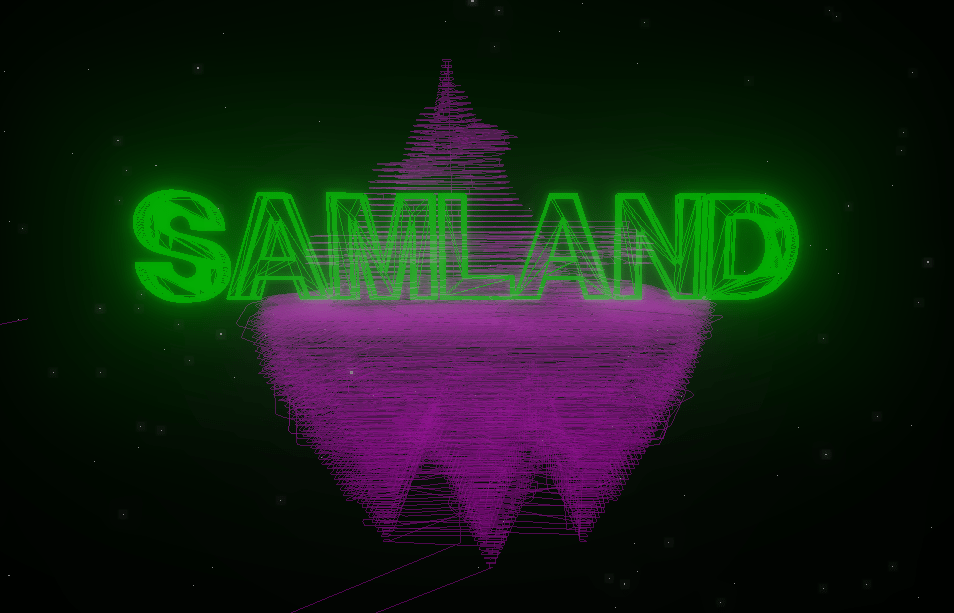
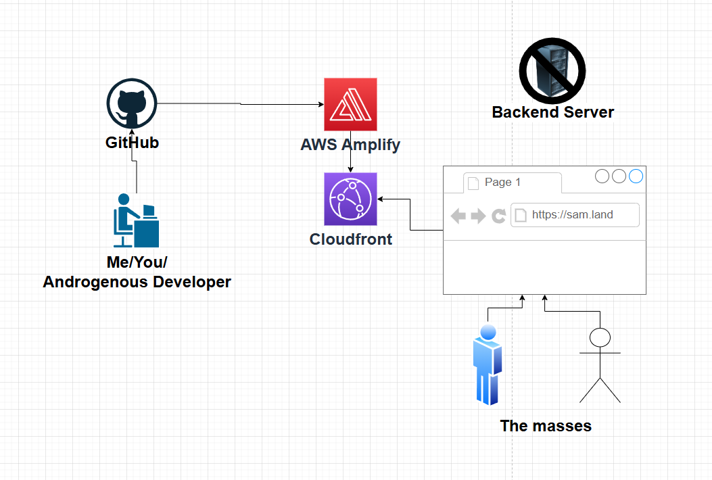

# Sam.Land v2 built with Astro

## Make it sexy.

## Diagram

## Technologies Used

- 🚀 **[Astro](https://astro.build/)** - Modern static site generator
- 🎨 **[Rodin](https://hyper3d.ai/rodin)** - AI-powered 3D model generation
- 🖥️ **[Three.js](https://threejs.org/)** - 3D graphics library
- ☁️ **[AWS Amplify](https://aws.amazon.com/amplify/)** - Cloud-based deployment and hosting

## 🧞 Commands

All commands are run from the root of the project, from a terminal:

| Command                   | Action                                           |
| :------------------------ | :----------------------------------------------- |
| `npm install`             | Installs dependencies                            |
| `npm run dev`             | Starts local dev server at `localhost:4321`      |
| `npm run build`           | Build your production site to `./dist/`          |
| `npm run preview`         | Preview your build locally, before deploying     |
| `npm run astro ...`       | Run CLI commands like `astro add`, `astro check` |
| `npm run astro -- --help` | Get help using the Astro CLI                     |
